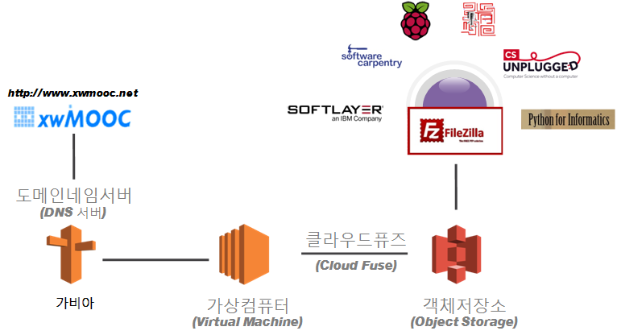
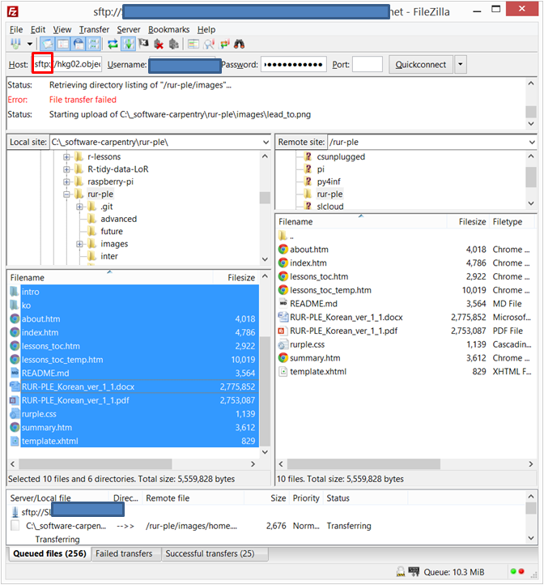

> ## 학습 목표
>
> *   객체 저장소를 데이터센터에 생성한다.
> *   객체 저장소 FTP를 통해 데이터를 업로드한다.
> *   객체 저장소를 가상컴퓨터와 연결한다.

## xwMOOC 서비스 배포

더이상 단일 서비스로 컴퓨터 교육을 만족시킬 수가 없기 때문에 [xwMOOC](http://www.xwmooc.net)에서 다양한 컴퓨터 교육 서비스를 개발했다. 
서비스 종류가 많아지고 복잡해짐에 따라 서비스를 종합적으로 관리할 필요성이 증가하여 다음과 같은 
[FTP(파일전송프로토콜)](http://ko.wikipedia.org/wiki/%ED%8C%8C%EC%9D%BC_%EC%A0%84%EC%86%A1_%ED%94%84%EB%A1%9C%ED%86%A0%EC%BD%9C)와 [클라우드 퓨즈(Cloud Fuse)](http://en.wikipedia.org/wiki/Filesystem_in_Userspace)를 이용한 클라우드 서비스 모형을 기획하게 되었다. [xwMOOC](http://www.xwmooc.net) 사용자가 도메인네임서버를 통해서 홍콩데이터센터 가상컴퓨터에 접속하게 되면 객체저장소(Object Storage)에 저장된 컴퓨터 교육 콘텐츠를 서비스를 제공하는 방식으로 되어 있고, 클라우드/소프트웨어 카펜트리/라즈베리파이/컴퓨터과학 언플러그드/러플/파이썬 콘텐츠는 정기적으로 [파일질라(Filezilla)](https://filezilla-project.org/)를 통해 FTP를 통해 갱신된다.

> ## {.prereq}
> 
> 1. 객체 저장소(Object Storage) 생성  
> 2. FTP를 통한 컴퓨터 교육 콘텐츠 전송  
> 3. 객체 저장소와 가상컴퓨터 클라우드 퓨즈 연결

## 1. 객체 저장소 생성

고객 포털(Customer Portal) 화면에서 `Storage` --> `Object Storage`를 클릭하고 객체저장소(Object Storage)가 위치할 데이터 센터를 지정한다. 예를 들어 `Tokyo 2`를 선택했다면, 다음에 `Order Object Storage`를 클릭해서 객체저장소 주문 내역(`Confirm Order`)을 확정한다.

## 2. FTP를 통한 컴퓨터 교육 콘텐츠 전송  

신규 컨테이너 명칭을 설정한다. `Add File` 혹은 `Add Folder`을 클릭하면 로컬 컴퓨터에서 파일이나 폴더를 올릴 수 있다. 
하지만 거의 수작업으로 시간이 많이 들고 오히려 번거러울 수 있다. `Add Folder`를 통해 업로드 대상 폴더만 생성하고 나서 
파일질라(Filezilla)를 통해서 FTP 연결을 해서 대량으로 디렉토리 및 폴더를 클라우드 홍콩 데이터센터 객체 저장소에 업로그드한다.

### 2.1. 파일질라(Filezilla) 통한 FTP 전송 

### 2.2. 홍콩 데이터센터 객체 저장소 

총 6개 컴퓨터 교육 콘텐츠 서비스가 1GB가 되지 않는 용량으로 잘 업로드된 것을 확인했다.
객체 저장소는 [오픈스택](https://www.openstack.org/) [스위프트](http://en.wikipedia.org/wiki/OpenStack#Object_Storage_.28Swift.29) 오픈소스에 기반하고 있다.

- `csunplugged` : 언플러그드 컴퓨터 과학 (Computer Science Unplugged)
- `pi` : 파이썬 라즈베리 파이 IoT 교육 콘텐츠
- `py4inf` : 정보교육을 위한 파이썬 -- 데이터 과학자로의 여정
- `rur-ple` : 러플(Rur-Ple)
- `scloud` : 소프트레이어 클라우드 컴퓨팅 -- 백만원 창업 도전
- `swcarpentry` : 소프트웨어 카펜트리 -- 과학 컴퓨팅을 위한 기본 소프트웨어 기술

> ## 오픈스택 {.callout}
>
> 오픈스택(OpenStack)은 IaaS 형태의 클라우드 컴퓨팅 오픈소스 프로젝트 이다. 
> 2012년 창설된 비영리 단체인 OpenStack Foundation에서 유지, 보수하고 있으며 아파치 라이선스하에 배포된다
> 프로세싱, 저장공간, 네트워킹의 가용자원을 제어하는 목적의 여러개의 하위 프로젝트로 이루어져 있다. 

## 3. 객체 저장소와 가상컴퓨터 클라우드 퓨즈 연결

객체 저장소와 가상컴퓨터를 연결하는데 [클라우드 퓨즈(CloudFuse)](http://redbo.github.io/cloudfuse/)를 사용한다. [클라우드 퓨즈(CloudFuse)](http://redbo.github.io/cloudfuse/)는 오픈스택 Swift가 설치된 클라우드 파일에 접근 기능을 제공하는 FUSE 응용프로그램이다.

## 3.1. 가상 컴퓨터 클라우드 퓨즈 설치

클라우드 퓨즈 설치를 위해서 먼저 `GitHub` 사이트에서 `wget https://github.com/redbo/cloudfuse/tarball/master` 명령으로 압축파일을 다운로드 받아 풀어 넣고, 다음 소프트웨어를 설치한다. `apt-get install build-essential libcurl4-openssl-dev libxml2-dev libssl-dev libfuse-dev` 명령어를 통해서 설치할 수 있다. 중간에 오류가 생길 수가 있으니 사전에 `apt-get install pkg-config` 명령을 실행한다.

~~~ {.input}
$ apt-get install pkg-config

$ wget https://github.com/redbo/cloudfuse/tarball/master
$ tar -xzvf master
$ cd redbo-cloudfuse-21358f1/

$ apt-get update
$ apt-get install build-essential libcurl4-openssl-dev libxml2-dev libssl-dev libfuse-dev
$ apt-get install fuse

$ ./configure
$ make install
~~~

### 3.2. 클라우드 퓨즈 환경설정 및 객체 저장소 연결

`Storage` --> `Object Storage` 데이터센터를 클릭하면 주문한 객체저장소가 나오고,
**View Credentials**에서 `usrname`, `api_key`, `authurl`(public) 정보를 *.cloudfuse* 파일에 다음과 같이 저장한다. 
단, `cd ~` 명령어로 루트 홈디렉토리에서 *.cloudfuse* 파일을 생성하는데 예를 들어, `sudo nano .cloudfuse`로 파일을 생성하고,
`usrname`, `api_key`, `authurl`(public) 정보를 다음과 같은 형식으로 작성한다.

~~~ {.input}
username=SLXXXXXX-2:SLXXXXX
api_key=7c7XXXXXXXXXXXXXXXXXXXXXXXXXXX
authurl=https://tok02.objectstorage.softlayer.net/auth/v1.0/
~~~

`cloudfuse /mnt` 명령어로 등록을 하게되면 정상적으로 올라간 것을 `mount` 명령어로 확인한다. 

~~~ {.input}
root@dev:~# cloudfuse /mnt
root@dev:~# mount
~~~

`cloudfuse`가 정상적으로 `/mnt`에 올라간 것을 확인할 수 있다.

~~~ {.output}
/dev/xvda2 on / type ext3 (rw,noatime,errors=remount-ro,barrier=0)
proc on /proc type proc (rw,noexec,nosuid,nodev)
sysfs on /sys type sysfs (rw,noexec,nosuid,nodev)
none on /sys/fs/cgroup type tmpfs (rw)
none on /sys/fs/fuse/connections type fusectl (rw)
none on /sys/kernel/debug type debugfs (rw)
none on /sys/kernel/security type securityfs (rw)
udev on /dev type devtmpfs (rw,mode=0755)
devpts on /dev/pts type devpts (rw,noexec,nosuid,gid=5,mode=0620)
tmpfs on /run type tmpfs (rw,noexec,nosuid,size=10%,mode=0755)
none on /run/lock type tmpfs (rw,noexec,nosuid,nodev,size=5242880)
none on /run/shm type tmpfs (rw,nosuid,nodev)
none on /run/user type tmpfs (rw,noexec,nosuid,nodev,size=104857600,mode=0755)
none on /sys/fs/pstore type pstore (rw)
/dev/xvda1 on /boot type ext3 (rw,noatime,barrier=0)
systemd on /sys/fs/cgroup/systemd type cgroup (rw,noexec,nosuid,nodev,none,name=
systemd)
none on /proc/xen type xenfs (rw)
cloudfuse on /mnt type fuse.cloudfuse (rw,nosuid,nodev)
~~~

~~~ {.input}
root@vm:~# cd /mnt
root@vm:/mnt# ls
~~~

~~~ {.output}
csunplugged  pi  py4inf  rur-ple  slcloud  swcarpentry
~~~

이제 오프서버 저장소가 웹서버 가상컴퓨터에 붙었으니 `/mnt/` 폴더 및 파일은 
클라우드 홍콩 데이터센터 객체 저장소와 싱크되어 자동으로 정보가 갱신된다.

### 3.3. 두 디렉토리 사이 동기화(Sync)

`클라우드 퓨즈(Cloud Fuse)`를 통해서 객체 저장소와 가상 컴퓨터를 동기화했으면 
다음으로 가장 많이 사용하는 웹서비스로 바로 연결될 수 있게 `rsync`를 사용해서 자동 동기화한다.
즉, 사용자 요청이 HTTP, TCP/IP로 웹서비스 요청이 들어오면, 로컬 컴퓨터에서 신규로 생성한 교육 콘텐츠를
FTP 파일전송프로토콜로 전송하게 되면 객체저장소에 저장이되고 클라우드퓨즈를 타고 가상 컴퓨터에 연결되고 
`rsync`를 통해서 웹서버를 통해 즉시 배포되게 된다.

~~~ {.output}
Browser             Virtual Machine                 Object Storage              Local Computer
+-------+           +-------------------+           +---------------+           +---------------+ 
|       |   HTTP    | /mnt     (rsync)  |  Cloud    | /rur-ple      |    FTP    | /rur-ple      |
| Users |<--------->|   *-----------*   |<--------->| /python       |<--------->| /python       |
|       |  TCP/IP   |    /var/www/html  |    Fuse   | /swcarpentry  |           | /swcarpentry  | 
+-------+           +-------------------+           +---------------+           +---------------+ 
~~~

`rsync -rtvuc --delete py4inf_html/ /var/www/html` 명령어를 통해서 `py4inf_html/`와 `/var/www/html` 디렉토리를 동기화한다.
출발 원천은 `py4inf_html/`이고, 목표 대상는 `/var/www/html`된다. `-rtvuc --delete`는 옵션 플래그다. 

- `-r` : 재귀(recursive)적으로 하위 디렉토리도 모두 동기화한다.
- `-t` : timestamp, 복사 시간 정보를 보관한다.
- `-v` : verbose, 모든 진행과정을 출력한다.
- `-u` : 중복을 제거하여 변경된 것만 복사해서 동기화한다.
- `-c` : checksum, 검사합이 동일한 것은 건너뛴다.  

~~~ {.input}
root@vm:/mnt/py4inf# rsync -rtvuc --delete py4inf_html/ /var/www/html
~~~

Bash [쉘스크립트](http://askubuntu.com/questions/339230/how-do-i-trigger-rsync-on-file-modification) `inotifywait` 기능을 통해서 동기화를 매번 FTP로 업로드할 때마다 자동으로 웹서비스로 동기화 배포한다.

~~~ {.input}
#!/bin/bash

while inotifywait -r /mnt/py4inf/py4inf_html/*; do
    rsync -av --delete /mnt/py4inf/py4inf_html/ /var/www/html
done
~~~
