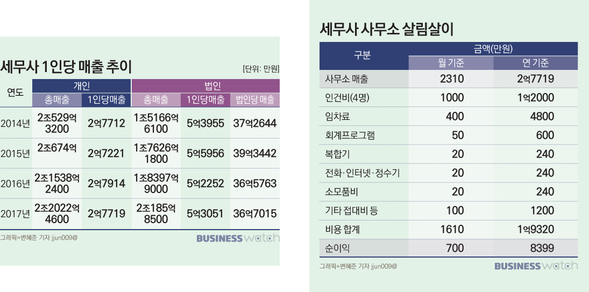
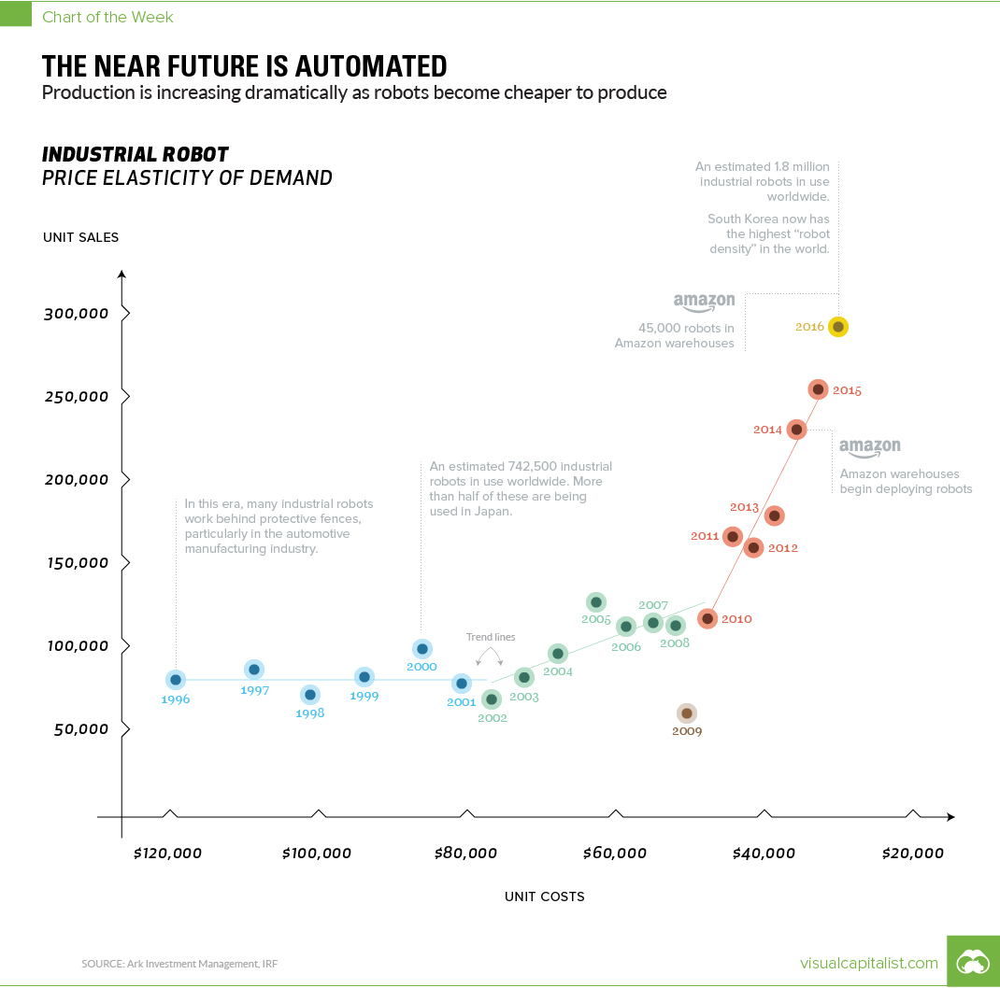
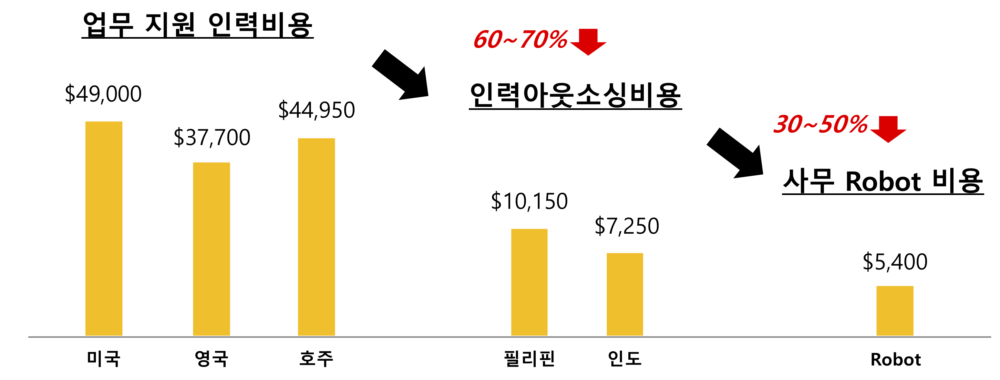
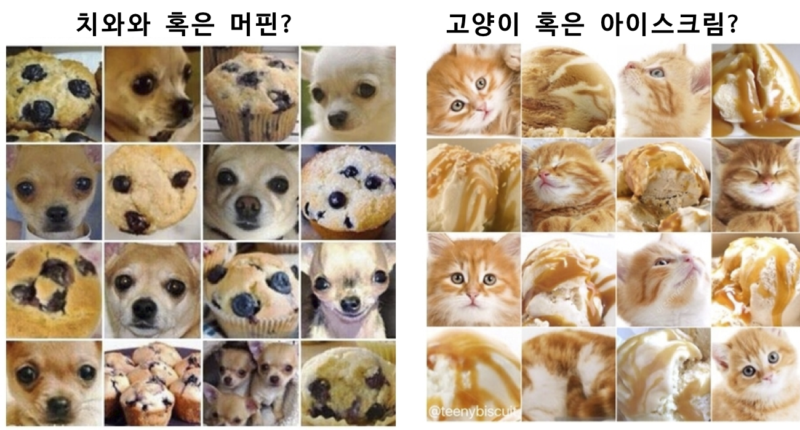
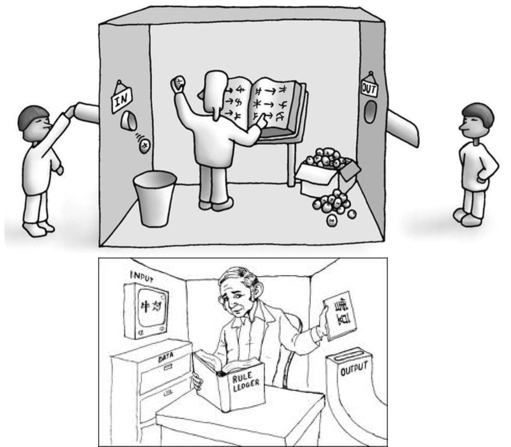
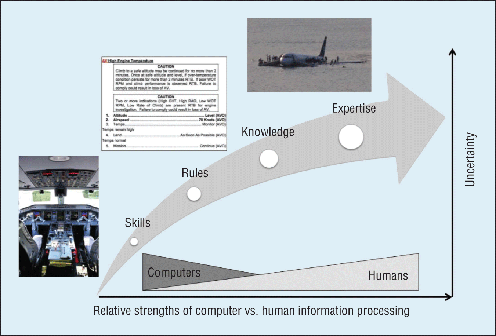
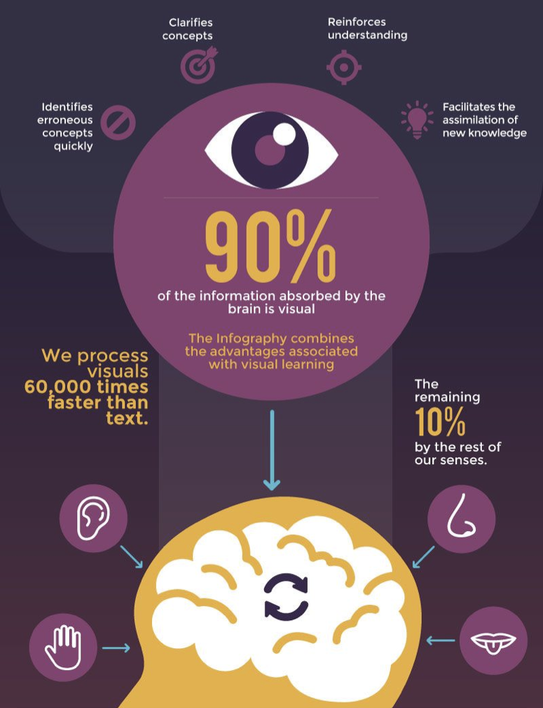
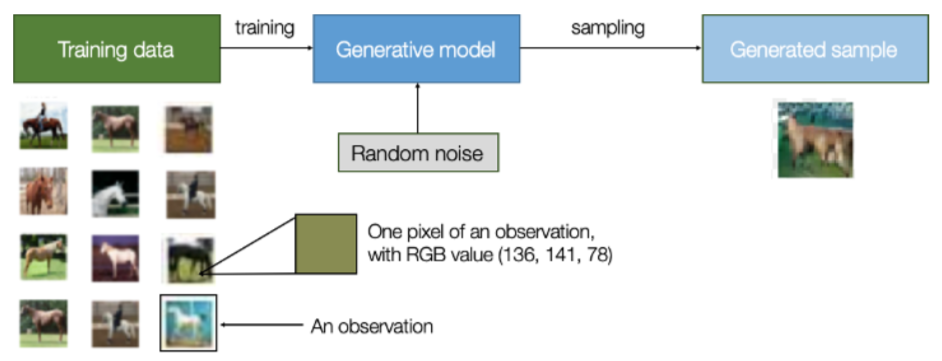
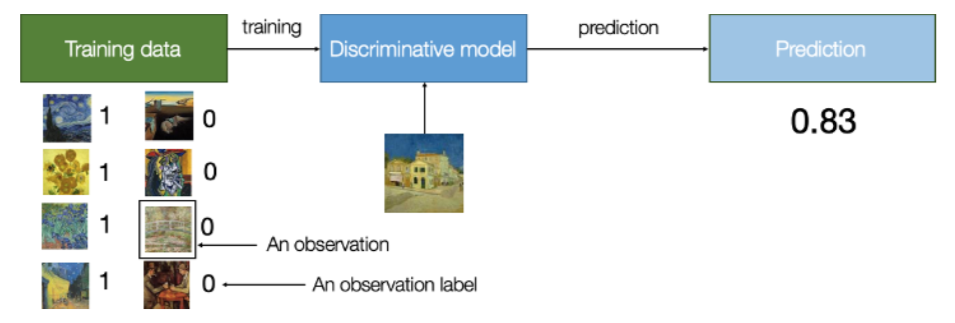

# 국가와 회사의 흥망 {#data-trends}

<div class = "row">
  <div class = "col-md-6">
**GDP 상위 15국 (1970-2017) **

<iframe width="300" height="180" src="https://www.youtube.com/embed/jCNSqEwh7GQ" frameborder="0" allow="accelerometer; autoplay; encrypted-media; gyroscope; picture-in-picture" allowfullscreen></iframe>

<br>

데이터 출처: UNdata - http://data.un.org/
  </div>
  <div class = "col-md-6">
**글로벌 브랜드 가치 상위 15사 (2000-2018)**

<iframe width="300" height="180" src="https://www.youtube.com/embed/BQovQUga0VE" frameborder="0" allow="accelerometer; autoplay; encrypted-media; gyroscope; picture-in-picture" allowfullscreen></iframe>

<br>

데이터 출처: https://www.interbrand.com/
  </div>
</div>

# 사람은 필요없습니다. [^humans-need-not-apply] {#humans-need-not-apply}

[^humans-need-not-apply]: [CGP Grey (2014), "Humans Need Not Apply"](https://www.youtube.com/watch?v=7Pq-S557XQU&list=PLss17BI0c8zsYclJIwjyecYKiY6-qCodX&index=2)

<div class = "row">
  <div class = "col-md-6">
**Humans Need Not Apply**

<iframe width="300" height="180" src="https://www.youtube.com/embed/EK2iSPjryRM" frameborder="0" allow="accelerometer; autoplay; encrypted-media; gyroscope; picture-in-picture" allowfullscreen></iframe>

  </div>
  <div class = "col-md-6">
**Automated Economy Explained: Mechanics of a Basic Income**

<iframe width="300" height="180" src="https://www.youtube.com/embed/OEkT14RBzDI" frameborder="0" allow="accelerometer; autoplay; encrypted-media; gyroscope; picture-in-picture" allowfullscreen></iframe>


  </div>
</div>


# 세무사 업무 변천과정 [^evolution-tax] {#change-automation}

과거 숫자를 다룰 수 있는 소수의 사람만이 숫자의 계산을 암산에서 벗어나  주판의 도움으로 생산성을 주판을 사용하지 못한 사람과 비교하여 수십배에서 수천배의 정확도와 함께 빠른 계산을 달성하게 되었다. 이러한 주판은 중간에 기계장치 계산기(찰스 배비지)도 있었지만, 일제 전자계산기로 자리를 내어주지만 사칙연산만 이해하면 기존 주판과 비교하여 어마어마한 생산성을 향상과 정확도를 높인 것은 분명하다.

이후, 개인용 컴퓨터의 보급으로 비지칼크와 로터스 1-2-3가 그 가능성을 열었다면 마이크로소프트 엑셀 스프레드쉬트 프로그램이 세무사 업무의 생산성을 또한 엄창나게 올린 것도 사실이다. 

이제 문제가 되는 것은 [PC 매거진, "The Best Tax Software for 2019"](https://www.pcmag.com/roundup/167894/the-best-tax-software)에 소개된 세금관련 프로그램이 $39 달러에 불과하다는 점이다. 1년 세무업무가 개인의 경우 4만원에 불과한데 세무사가 이런 자동화된 기계와 경쟁에서 승리할 수 있는가? 결과는 명확하다.

{#id .class width="100%"}

[^evolution-tax]: [PC 매거진, "The Best Tax Software for 2019"](https://www.pcmag.com/roundup/167894/the-best-tax-software)

## 연도별 세무사 합격자 {#tax-exam-trend}

[등록세무사만 1만3000명인데 합격자를 늘리다니… 세무사회 불만 고조](http://biz.newdaily.co.kr/site/data/html/2019/01/22/2019012200053.html) 기사 내용에도 언급되었어듯이 2008년부터 11년간 630명가량을 다소 편차가 있지만 뽑아왔다. 현재 한국세무사회에 등록된 [개인 및 법인현황](http://www.kacpta.or.kr/)을 통해 12,973명이 개업하여 활동하고 있는 것으로 집계되어 있다.


```r
library(tidyverse)
library(rvest)

tax_url <- "http://www.wcpa.co.kr/cta/info_ystats.php"

# Sys.setlocale("LC_ALL", "C")

exam_df <- tax_url %>% 
  read_html() %>% 
  html_node(xpath = '/html/body/div[1]/div[2]/div/div[2]/div[2]/div/ul[2]/li/div/table') %>% 
  html_table(fill = TRUE)

# Sys.setlocale("LC_ALL", "Korean")

exam_df %>% 
  gather(year, value, -`구분`) %>% 
  filter(구분 == "합격자") %>% 
  select(연도=year, 합격자=value) %>% 
  knitr::kable()
```


|연도 |합격자 |
|:----|:------|
|2012 |654    |
|2013 |631    |
|2014 |631    |
|2015 |630    |
|2016 |634    |
|2017 |630    |
|2018 |       |

## 세무사 연봉 [^tax-accountant-salary] {#tax-accountant-salary}

[^tax-accountant-salary]: [임명규 (2018.10.10), "세무사는 얼마나 벌까요", Business Watch](http://news.bizwatch.co.kr/article/tax/2018/10/05/0010)




# 자동화와 직업 통계자료 {#automation-job-statistics} 

## 산업용 로봇  [^industrial-robot] {#industrial-robot}

[^industrial-robot]: [Ang Ahlstrom (May 24, 2018), "Chart: Why Industrial Robot Sales are Sky High"](https://www.visualcapitalist.com/industrial-robot-sales-sky-high/)

[Ang Ahlstrom (May 24, 2018), "Chart: Why Industrial Robot Sales are Sky High"](https://www.visualcapitalist.com/industrial-robot-sales-sky-high/) 기사에 언급되었듯이 2010년을 기점으로 산업용 로봇은 엄청난 성장세를 타고 있다. 특히, 2008년 금융위기를 기점으로 산업용 로봇 공급은 급격히 늘어나고 있다.

{#id .class width="77%"}

기사가 반영하지 못한 가장 최근 추세를 추가해서 시각화 한다.


```r
library(tidyverse)
library(rvest)

robot_url <- "https://en.wikipedia.org/wiki/Industrial_robot"

robot_dat <- robot_url %>%
  read_html() %>%
  html_nodes(xpath='//*[@id="mw-content-text"]/div/table[2]') %>%
  html_table(fill = TRUE) %>% 
  .[[1]]

robot_dat %>% 
  tbl_df %>% 
  mutate(supply = parse_number(supply)) %>% 
  ggplot(aes(x=Year, y=supply)) +
    geom_line() +
    geom_point() +
    expand_limits(y=0) +
    scale_y_continuous(labels = scales::comma) +
    theme_bw(base_family = "AppleGothic") +
    labs(x="", y="산업용 로봇 공급대수", title="전세계 연간 산업용 로봇 공급대수")
```


## 생산성과 임금 격차 {#wage-productivity-gap}

[Economic Policy Institute, "The Productivity - Pay Gap", July 2019](https://www.epi.org/productivity-pay-gap/)

생산성이 오르면 임금도 따라 오른 다는 것이 그동안의 믿음이었다. 
하지만, 생산성이 오른다고 임금도 따라 오르지 않는 현상이 1979년부터 심화되고 있다. 이를 데이터를 통해서 확인해보자. 

데이터 출처: EPI analysis of unpublished Total Economy Productivity data from Bureau of Labor Statistics (BLS) Labor Productivity and Costs program, wage data from the BLS Current Employment Statistics, BLS Employment Cost Trends, BLS Consumer Price Index, and Bureau of Economic Analysis National Income and Product Accounts Updated from Figure A in Raising America’s Pay: Why It’s Our Central Economic Policy Challenge (Bivens et al. 2014)


```r
library(tidyverse)

productivity_gap <- tribble(~"Year",~"Hourly compensation", ~"Net productivity",
"1948", "0.00%"  ,"0.00%",
"1949", "6.24%"  ,"1.55%",
"1950", "10.46%"  ,"9.34%",
"1951", "11.74%"  ,"12.24%",
"1952", "15.02%"  ,"15.49%",
"1953", "20.82%"  ,"19.41%",
"1954", "23.48%"  ,"21.44%",
"1955", "28.70%"  ,"26.38%",
"1956", "33.89%"  ,"26.59%",
"1957", "37.08%"  ,"30.04%",
"1958", "38.08%"  ,"32.72%",
"1959", "42.46%"  ,"37.63%",
"1960", "45.38%"  ,"40.06%",
"1961", "47.84%"  ,"44.37%",
"1962", "52.32%"  ,"49.80%",
"1963", "54.86%"  ,"55.03%",
"1964", "58.32%"  ,"59.94%",
"1965", "62.27%"  ,"64.92%",
"1966", "64.70%"  ,"69.95%",
"1967", "66.68%"  ,"71.98%",
"1968", "71.05%"  ,"77.13%",
"1969", "74.39%"  ,"77.85%",
"1970", "76.81%"  ,"80.35%",
"1971", "81.66%"  ,"87.10%",
"1972", "91.34%"  ,"92.20%",
"1973", "90.96%"  ,"96.96%",
"1974", "87.05%"  ,"93.83%",
"1975", "86.86%"  ,"98.11%",
"1976", "89.35%"  ,"103.59%",
"1977", "92.82%"  ,"106.05%",
"1978", "95.66%"  ,"108.27%",
"1979",  "93.25%",  "108.11%",
"1980", "88.05%"  ,"106.77%",
"1981", "87.36%"  ,"110.50%",
"1982", "87.70%"  ,"108.37%",
"1983", "88.49%"  ,"114.51%",
"1984", "87.03%"  ,"120.21%",
"1985", "86.18%"  ,"123.65%",
"1986", "87.25%"  ,"128.28%",
"1987", "84.67%"  ,"128.80%",
"1988", "84.02% ",  "132.01%",
"1989", "83.93%"  ,"134.12%",
"1990", "82.37%"  ,"136.95%",
"1991", "82.02%"  ,"138.50%",
"1992", "83.20%"  ,"147.48%",
"1993", "83.46%"  ,"148.51%",
"1994", "83.89%"  ,"150.54%",
"1995", "82.76%"  ,"151.59%",
"1996", "82.87%"  ,"156.24%",
"1997", "84.87%"  ,"160.72%",
"1998", "89.27%"  ,"166.21%",
"1999", "91.98%"  ,"173.46%",
"2000", "92.96%"  ,"179.47%",
"2001", "95.60%"  ,"183.71%",
"2002", "99.49%"  ,"191.50%",
"2003", "101.58%",  "201.22%",
"2004", "100.56%",  "209.29%",
"2005", "99.73%"  ,"215.29%",
"2006", "99.88%"  ,"217.61%",
"2007", "101.45%",  "219.78%",
"2008", "101.39%",  "221.39%",
"2009", "109.30%",  "228.75%",
"2010", "111.00%",  "238.23%",
"2011", "108.47%",  "238.21%",
"2012", "106.50%",  "239.57%",
"2013", "108.40%",  "240.96%",
"2014", "109.08%",  "242.91%",
"2015", "112.41%",  "245.75%",
"2016", "114.39%",  "246.34%",
"2017", "114.67%",  "249.78%",
"2018", "115.62%",  "252.90%")

productivity_gap_df <- productivity_gap %>% 
  mutate(`Hourly compensation` = parse_number(`Hourly compensation`) / 100,
         `Net productivity`    = parse_number(`Net productivity`) / 100,
         Year = as.integer(Year)) 

productivity_gap_long_df <- productivity_gap_df %>%
  mutate(gap = abs(`Net productivity` - `Hourly compensation`)) %>% 
  gather(metric, value, - Year)

productivity_gap_long_df %>% 
  ggplot(aes(x=Year, y=value, group=metric, color=metric)) +
    geom_line() +
    geom_point(size=0.3) +
    scale_y_continuous(labels = scales::percent) +
    theme_bw(base_family="NanumGothic") +
    labs(x="", y="", title="Productivity growth and hourly compensation growth, 1948-2018",
         color="생산성과 시간당 급여",
         caption="자료출처: https://www.epi.org/productivity-pay-gap/") +
    theme(legend.position = "top") +
    facet_wrap(~metric)
```


```r
library(plotly)
```

```
Error in library(plotly): there is no package called 'plotly'
```

```r
productivity_gap_g <- productivity_gap_long_df %>% 
  ggplot(aes(x=Year, y=value, color=metric)) +
    geom_line() +
    geom_point(size=0.3) +
    scale_y_continuous(labels = scales::percent) +
    theme_bw(base_family="NanumGothic") +
    labs(x="", y="", title="Productivity growth and hourly compensation growth, 1948-2018",
         color="생산성과 시간당 급여",
         caption="") +
    theme(legend.position = "top")

plotly::ggplotly(productivity_gap_g)
```

```
Error in loadNamespace(name): there is no package called 'plotly'
```


## 보울리 법칙(Bowley's Law) {#bowley-law}

앞서 언급한 임금과 노동생산성 간 격차의 지속적 증가는 노동소득분배율 (labour income share)의 감소로 연결되는데, 노동소득분배율은 총국민소득 중 노동소득이 차지하는 비중으로 보울리의 법칙으로 불리며 경제성장이나 발전과는 상관없이 기능적 소득분배((functional income distribution))가 장기적으로 일정하다는 가설인데 이것이 최근 깨지고 있다. [^bowley-law]

[^bowley-law]: [이상혁(2014), "제네바에서 온 편지: 당신의 월급은 공정합니까?", slow news](https://slownews.kr/24431)

FRED Economic Data 중 [Shares of gross domestic income: Compensation of employees, paid: Wage and salary accruals: Disbursements: to persons (W270RE1A156NBEA)](https://fred.stlouisfed.org/series/W270RE1A156NBEA) 다운로드 받아 시각화한다.
미국 노동소득분배율이 50%대에서 40%초반으로 훅 떨어진 것이 시각적으로 확인된다.
이에 대해서 ILO 세계임금보고서와 다른 [OECD (2015), "The Labour Share in G20 Economies"](https://www.oecd.org/g20/topics/employment-and-social-policy/The-Labour-Share-in-G20-Economies.pdf) 내용을 통해 다양한 원인을 살펴볼 수 있다.

- 노동분배몫 하락 요인 (ILO 세계임금보고서, 2012)
    - 산업구조 변화와 기술 변화
    - 세계화
    - 금융화(financialization)
    - 노동시장과 복지정책의 약화


```r
labor_share <- tribble(~"date",	~"share",
"1948-01-01",	"49.3",
"1949-01-01",	"49.7",
"1950-01-01",	"49.3",
"1951-01-01",	"49.9",
"1952-01-01",	"50.9",
"1953-01-01",	"51.6",
"1954-01-01",	"50.9",
"1955-01-01",	"50.1",
"1956-01-01",	"50.7",
"1957-01-01",	"50.6",
"1958-01-01",	"50.2",
"1959-01-01",	"49.8",
"1960-01-01",	"50.2",
"1961-01-01",	"49.8",
"1962-01-01",	"49.5",
"1963-01-01",	"49.3",
"1964-01-01",	"49.3",
"1965-01-01",	"49.0",
"1966-01-01",	"49.5",
"1967-01-01",	"50.1",
"1968-01-01",	"50.3",
"1969-01-01",	"51.0",
"1970-01-01",	"51.6",
"1971-01-01",	"50.6",
"1972-01-01",	"50.2",
"1973-01-01",	"49.9",
"1974-01-01",	"50.2",
"1975-01-01",	"48.7",
"1976-01-01",	"48.5",
"1977-01-01",	"48.2",
"1978-01-01",	"48.1",
"1979-01-01",	"48.5",
"1980-01-01",	"48.8",
"1981-01-01",	"47.7",
"1982-01-01",	"47.6",
"1983-01-01",	"46.9",
"1984-01-01",	"46.2",
"1985-01-01",	"46.3",
"1986-01-01",	"46.7",
"1987-01-01",	"46.9",
"1988-01-01",	"46.6",
"1989-01-01",	"46.3",
"1990-01-01",	"46.7",
"1991-01-01",	"46.4",
"1992-01-01",	"46.3",
"1993-01-01",	"45.9",
"1994-01-01",	"45.3",
"1995-01-01",	"45.3",
"1996-01-01",	"45.1",
"1997-01-01",	"45.2",
"1998-01-01",	"45.8",
"1999-01-01",	"46.1",
"2000-01-01",	"46.6",
"2001-01-01",	"46.3",
"2002-01-01",	"45.3",
"2003-01-01",	"44.8",
"2004-01-01",	"44.3",
"2005-01-01",	"43.4",
"2006-01-01",	"43.2",
"2007-01-01",	"44.3",
"2008-01-01",	"44.9",
"2009-01-01",	"43.8",
"2010-01-01",	"42.6",
"2011-01-01",	"42.4",
"2012-01-01",	"42.1",
"2013-01-01",	"41.9",
"2014-01-01",	"41.9",
"2015-01-01",	"42.5",
"2016-01-01",	"42.9",
"2017-01-01",	"43.2",
"2018-01-01",	"43.2")

library(dygraphs)
```

```
Error in library(dygraphs): there is no package called 'dygraphs'
```

```r
library(xts)
```

```
Error in library(xts): there is no package called 'xts'
```

```r
## Dataframe --> XTS
labor_share_df <- labor_share %>% 
  mutate(date = lubridate::ydm(date),
         share = parse_number(share)/100)

labor_share_xts <- xts(x = labor_share_df$share, order.by = labor_share_df$date)
```

```
Error in xts(x = labor_share_df$share, order.by = labor_share_df$date): 함수 "xts"를 찾을 수 없습니다
```

```r
colnames(labor_share_xts) <- "share" 
```

```
Error in colnames(labor_share_xts) <- "share": 객체 'labor_share_xts'를 찾을 수 없습니다
```

```r
## Dygraph 시각화  
 # https://gist.github.com/Arkoniak/8191386f2e36309f694511dfd5bf0808
dygraph(labor_share_xts, 
        main = "미국 노동소득분배율 연도별 추이 (1948 - 2018)", 
        ylab = "노동소득분배율(%)") %>% 
  dyRangeSelector() %>% 
  dyAxis("y", valueFormatter = "function(v){return (v*100).toFixed(1) + '%'}",
              axisLabelFormatter = "function(v){return (v*100).toFixed(0) + '%'}")
```

```
Error in dygraph(labor_share_xts, main = "미국 노동소득분배율 연도별 추이 (1948 - 2018)", : 함수 "dygraph"를 찾을 수 없습니다
```


## 노동인력 참여율 {#labor-participation}

[Federal Reserve Bank of ST. Louis](https://research.stlouisfed.org/docs/api/api_key.html) 웹사이트에서 API-KEY 발급받아 `usethis::edit_r_environ()` 명령어를 통해서 API 키를 잘 관리한다.

`fredr` 팩키지를 활용하여 직접 웹사이트에서 크롤링하는 번거러움을 해결한다. 
`fredr_set_key(FRED_KEY)` 명령어로 API-KEY를 설정한다.


```r
library(fredr)
```

```
Error in library(fredr): there is no package called 'fredr'
```

```r
library(xts)
```

```
Error in library(xts): there is no package called 'xts'
```

```r
fredr_set_key(FRED_KEY)
```

```
Error in fredr_set_key(FRED_KEY): 함수 "fredr_set_key"를 찾을 수 없습니다
```

```r
## Labor Force Participation Rate (CIVPART)	데이터 가져오기
labor_participation <- fredr(
  series_id = "CIVPART",
  observation_start = as.Date("1948-01-01")
) %>% 
  mutate(value = value/100)
```

```
Error in fredr(series_id = "CIVPART", observation_start = as.Date("1948-01-01")): 함수 "fredr"를 찾을 수 없습니다
```

```r
## DF --> XTS 자료 변환
labor_participation_xts <- xts(labor_participation$value, order.by = labor_participation$date)
```

```
Error in xts(labor_participation$value, order.by = labor_participation$date): 함수 "xts"를 찾을 수 없습니다
```

```r
## 인터랙티브 시계열 시각화
dygraph(labor_participation_xts, 
        main = "미국 노동참여율 연도별 추이 (1948 - 2018)", 
        ylab = "노동참여율(%)") %>% 
  dyRangeSelector() %>% 
  dyAxis("y", valueFormatter = "function(v){return (v*100).toFixed(1) + '%'}",
              axisLabelFormatter = "function(v){return (v*100).toFixed(0) + '%'}")
```

```
Error in dygraph(labor_participation_xts, main = "미국 노동참여율 연도별 추이 (1948 - 2018)", : 함수 "dygraph"를 찾을 수 없습니다
```

## 소싱전략의 변화 {#strategy-change}

Kinetics consulting services / Automation Anywhere 자료에 의하면 비정규직 인력아웃소싱 비용도 현재 시점에서 사무 로봇을 사용하게 되면 더욱 줄일 수 있다는 조사결과를 제시하고 있다. 

{#id .class width="100%"}

# 자동화 [^missy-automation] {#automation-overview}

[^missy-automation]: [Mary (Missy) Cummings, "Man versus Machine or Man + Machine?", Ieee INteLLIGeNt sYstems](https://hal.pratt.duke.edu/sites/hal.pratt.duke.edu/files/u10/IS-29-05-Expert%20Opinion%5B1%5D_0.pdf)

기계(Machine)하면 우선 기계장치를 떠올릴 수 있지만, 영어로 머신(machine)은 인공지능을 탑재한 컴퓨터도 의미하기 한다.
자동화 수준을 전혀 컴퓨터, 즉 기계의 도움없이 모든 결정과 행동을 사람이 취하는 수준부터,
인간을 배제하고 기계가 모든 의사결정을 내리고 자율적으로 운전, 판결, 세금계산 등등을 하는 완전한 자동화까지로 수준을 나눌 수 있다.
인간의 어떤 영역은 자동화가 많이 진행되었고, 또 다른 영역은 자동화가 진행되고 있거나, 어떤 영역은 거의 완전한 자동화가 진행된 부분도 있다.

| 자동화 수준 | 자동화 수준 설명 |
|:-----------:|:------------------------------------------|
|     1       | 컴퓨터는 어떤 도움도 주고 있지 못함: 사람이 모든 결정을 해야하고 행동도 취해야 함 |
|     2       | 컴퓨터가 대안이 될 수 있는 의사결정 목록과 행동목록을 제시함 |
|    3       | 선택지를 몇개로 줄여줌 |
|    4       | 대안을 제시함  |
|    5       | 사람이 승인하면 제안된 것을 실행함.  |
|    6       | 자동 실행하기 전에 사람에게 거부권을 행사할 시간을 부여함 |
|    7       | 자동으로 실행하고 나서, 필요할 때만 인간에게 통보함 |   
|    8       | 컴퓨터가 요청을 받을 때만 인간에게 통보함 |  
|    9       | 컴퓨터가 결정을 내려야 될 때만, 인간에게 통보함 |
|   10       | 인간을 배제하고, 컴퓨터가 모든 결정을 내리고 행동도 자율적으로 취함.

## 사람과 기계 비교 {#man-human-comparison}

사람과 기계는 서로 다른 잘하는 영역이 나눠져 있었다.
단어를 세고 가장 많이 사용되는 단어를 찾는 것은 컴퓨터에게는 무척이나 쉬운 작업인 반면, 논문이나 책에서 텍스트를 읽고 이해하는 것은 컴퓨터에게 어렵다. 사람은 지루하고 반복되는 문제를 해결하는데 적합하지 않은 반면에 컴퓨터는 추상적이고 일반화하는 작업에는 적합지 않았다. 
이런 사실은 1970년대 미국 카네기 멜론 대학 (CMU) 로봇 공학자 한스 모라벡(Hans Moravec) 교수의 **모라벡의 역설(Moravec's paradox)**로 잘 알려져 있다.

|   속성  |        사람         |         기계        |
|:---------:|:---------------------:|:---------------------:|
|   속도  |  상대적으로 느림    |        탁월함       | 
| 경격출력 | 상대적으로 약함    | 일관된 작업에 우수성을 보임 |
| 일관성  | 믿을 수 없는 학습능력과 피로 | 일관되고 반복적인 작업에 이상적임 |
| 정보처리능력 | 주로 한개 채널   | 멀티 채널 |
| 기억     | 원칙과 전략에 좋음. 다재다능하고 혁신적임 |문자 그대로 재현하는데 이상적임, 형식적임 |
| 추론 계산 | 귀납적, 프로그램하기 더 좋고, 느리고, 오류 수정 좋음 | 연역적, 프로그램하기 귀찮고, 빠르고 정확, 오류 수정 나쁨 |
| 감지(sensing) | 넓은 감지 반경, 다기능, 분별력 | 정량적 평가에 좋지만, 패턴인식에는 나쁨 |
| 인지(perceiving) | 변화에 더 잘 대응 | 잡음에 취약하여 변화에 잘 대응 못함. |


<style>
div.blue { background-color:#e6f0ff; border-radius: 5px; padding: 10px;}
</style>
<div class = "blue">

**모라벡의 역설(Moravec's paradox)**

미국 카네기 멜론 대학 (CMU) 로봇 공학자 한스 모라벡(Hans Moravec)이 1970년대에 ‘it is comparatively easy to make computers exhibit adult level performance on intelligence tests or playing checkers, and difficult or impossible to give them the skills of a one-year-old when it comes to perception and mobility’라는 표현으로 컴퓨터와 인간의 능력 차이를 역설적으로 표현하였다.

즉, 인간은 걷기, 느끼기, 듣기, 보기, 의사소통 등의 일상적인 행위는 매우 쉽게 할 수 있는 반면 복잡한 수식 계산 등을 하기 위해서는 많은 시간과 에너지를 소비하여야 하는 반면, 컴퓨터는 인간이 하는 일상적인 행위를 수행하기 매우 어렵지만 수학적 계산, 논리 분석 등은 순식간에 해낼 수 있다.



</div>

## **중국어 방 주장 [^chinese-room] [^wiki-chinese-room]** {#chinese-room}

[^chinese-room]: [중국어 방 역설 (Chinese room argument) - 대체 누가 중국어를 이해하고 있는가?](http://ko.experiments.wikidok.net/wp-d/592f718da44f1a4153e80611/View)

[^wiki-chinese-room]: [위키백과, "중국어 방"](https://ko.wikipedia.org/wiki/%EC%A4%91%EA%B5%AD%EC%96%B4_%EB%B0%A9)

중국어 방 혹은 중국인 방(영어: Chinese room)은 존 설(John Searle)이 튜링 테스트로 기계의 인공지능 여부를 판정할 수 없다는 것을 논증하기 위해 고안한 사고실험이다.

> 우선 방 안에 영어만 할 줄 아는 사람이 들어간다. 그 방에 필담을 할 수 있는 도구와, 미리 만들어 놓은 중국어 질문과 질문에 대한 대답 목록을 준비해  둔다. 이 방 안으로 중국인 심사관이 중국어로 질문을 써서 안으로 넣으면 방 안의 사람은 그것을 준비된 대응표에 따라 답변을 중국어로 써서 밖의 
> 심사관에게 준다.

안에 어떤 사람이 있는지 모르는 중국인이 보면 안에 있는 사람은 중국어를 할 줄 아는 것처럼 보인다. 그러나, 안에 있는 사람은 실제로는 중국어를 전혀 모르는 사람이고, 중국어 질문을 이해하지 않고 주어진 표에 따라 대답할 뿐이다. 이로부터 중국어로 질문과 답변을 완벽히 한다고 해도 안에 있는 사람이 중국어를 진짜로 이해하는지 어떤지 판정할 수 없다는 결론을 얻는다. 이와 마찬가지로 지능이 있어서 질문 답변을 수행할 수 있는 기계가 있어도 그것이 지능을 가졌는지는 **튜링 테스트**로는 판정할 수 없다는 주장이다.

{#id .class width="77%"}


결국 다음과 같이 컴퓨터, 인간, 인공지능을 비교할 수 있다. 
중국어 방이 하드웨어, 인간의 외형적인 몸체라면, 질문과 답변을 입출력으로 정의할 수 있고,
질문&대답 목록과 처리 규칙을 담은 알고리즘을 데이터베이스/알고리즘, 습득된 경험, 지식, 지능으로 대응할 수 있다. 

|  인공지능 |       컴퓨터      |       인간            |
|:---------:|:-----------------:|:---------------------:|
| 중국어 방 |      하드웨어     | 인간의 외형적인 몸체  |
| 영어만 할 줄 아는 사람| 소프트웨어| 인간의 지능 |
| 중국어로 된 질문 | 입력(Input) | 인간이 외부에서 접할 수 있는 자극 |
| 중국어로 된 답변 | 출력(Output) | 인간이 외부에서 접한 자극에 대한 반응 |
| 질문&대답 목록 | 데이터베이스(Database) | 습득된 기억 |

# 사람과 기계 업무 분장 {#man-human-boundary}

앞서 자동화 수준을 1-10 사이로 구분했다면, 사람과 기계 사이의 업무 분장 경계를 적당히 지어야만 해당 문제를 자동화를 통해서 최선의 결과를 낼 수 있다. 오랜동안 논란이 되었지만, 대표적으로 달에 사람을 보내는 아폴로 계획에서 사람과 기계의 역할을 어떻게 구분하는 것이 좋은지는 항상 논란이 되어왔고 오늘날까지 이어지고 있다.

{#id .class width="100%"}

듀크 대학과 MIT 매리 커밍스(Mary Cummings) 교수는 기존 S-R-K 틀에 E를 더 붙이는 등 확장을 하여 다음과 같은 기계와 사람이 잘하는 분야, 즉 자동화가 되는 영역과 자동화의 도움을 받는 영역으로 범주화 시켰다. 매리 커밍스 교수가 F-18 여성 조종사 경력을 바탕으로 항공 사례를 예시로 들고 있다.

<div class = "row">
  <div class = "col-md-6">
**인지작업과 자동화 정도**

| 인지 작업 (cognitive behavior/task) | 자동화 정도(degree of automation) |
|:--------------------------:|--------------------------|
| 기량(skill-based)        | 자동화에 최적화됨. 물론 내외부 상태와 오류 피드백에 대한 신뢰성있는 센서를 가정 |
| 규칙(rule-based)         | 자동화 가능한 대상. 물론 규칙집합이 잘 만들어지고 테스트된 것을 가정 |
| 지식(knowledge-based)    | 일부 자동화를 통해 데이터를 조직화하고, 필터링하고, 합성하는데 도움을 줌 |
| 전문적 식견(expertise)   | 사람이 가장 잘 할 수 있지만, 팀동료로 자동화 기계를 통해 도움을 받을 수 있음 |

  </div>
  <div class = "col-md-6">
**Skill-Rule-Knowledge-Experties**

{#id .class width="100%"}

  </div>
</div>


최근 자동화 기계는 드론, 무인 자동차, 무인 화물자동차, 무인 비행기, 무인 선박 모두 센서와 액추에이터를 통해서 자동으로 설정한 목표를 달성하게 되어 있지만 이는 중앙 컴퓨터의 제어를 받는다. 중앙 컴퓨터 제어는 결국 사람이 화면을 보고 제어 로직을 심어둔 것으로 크게 볼 수 있다.

{#id .class width="100%"}

## 이세돌 9단 [^retire-lee] {#play-go}

이창호를 누르고 바둑 최강자에 굴림해온 전설적인 이세돌 9단. 하지만 알파고가 나온 이후 모든 것이 바뀌었다. 커제는 알파고와 대결에서 울기도 했고, 5명의 프로기사가 때로 알파고에 덥비기도 했다. 그렇다고 결과가 바뀐 것은 아니다. NHN에서 20년동안 학습한 바둑 프로그램 한돌과 2점 깔고 두는 접바둑으로 마지막 대국을 남기고 평생을 함께 한 바둑을 놓으려고 한다. 

<iframe width="560" height="315" src="https://www.youtube.com/embed/gb4wbJfyg48" frameborder="0" allow="accelerometer; autoplay; encrypted-media; gyroscope; picture-in-picture" allowfullscreen></iframe>

[^retire-lee]: [이균성(2019.11.28), "이세돌 9단의 프로기사 포기는 ‘노동의 미래’다", ZDNET Korea](https://n.news.naver.com/article/092/0002175655)


# 기계에 대체되는 일자리 [^GAN-applications] [^machine-learning-mastery] {#challenge-to-human}

[^GAN-applications]: [Jonathan Hui (2018), "GAN -Some cool applications of GANs."](https://medium.com/@jonathan_hui/gan-some-cool-applications-of-gans-4c9ecca35900)

[^machine-learning-mastery]: [ Jason Brownlee (June 14, 2019), "18 Impressive Applications of Generative Adversarial Networks (GANs)"](https://machinelearningmastery.com/impressive-applications-of-generative-adversarial-networks/)

사람이 가지고 있는 오감(시각, 후각, 청각, 촉각, 미각) 중에서 시각을 대부분의 사람들은 가장 중요한 감각이라고 꼽는데 이유는 아마도 감각기관을 통해서 획득하는 정보의 90% 이상이 시각을 통해서 얻어진다는 점에 기인한다.

{#id .class width="50%"}

**GAN(Generative Adversarial Network)**은 생성적 적대 신경망라고 번역할 수 있다. 이안 굿펠로우(Ian Goodfellow)가 NIPS 학회에서 발표한 뒤로 딥러닝의 대가인 얀 르쿤(Yann Lecun) 교수는 GAN을 최근 10년간 머신러닝 연구 중 가장 혁신적인 아이디어로 극찬했다.

<div class = "row">
  <div class = "col-md-6">
**생성 모델링 과정**



  </div>
  <div class = "col-md-6">
**판별 모델링 과정**



  </div>
</div>

## 페인트(paint) {#challenge-to-human-paint}

[Keras-GAN](https://github.com/eriklindernoren/Keras-GAN) GitHub 사이트에는 `pix2pix`, `CycleGAN`을 포함한 다양한 시각적인 사례를 살펴볼 수 있다.

- 이미지 생성(Image generation): GAN을 사용하여 이미지를 기계가 자동으로 생성할 수 있다. 예를 들어 자동 로고생성기 등. [GitHub: alex-sage/logo-gen](https://github.com/alex-sage/logo-gen)
- 텍스트로 이미지 합성 (Text-to-image synthesis): 영화산업에서 시나리오가 있는 상태에서 텍스트를 기초로 하여 이미지를 자동 생성시킴. [Nikunj Gupta, "Text-to-Image Synthesis", Medium](https://medium.com/datadriveninvestor/text-to-image-synthesis-6e5de1bf86ec), [GitHub, text-to-image](https://github.com/crisbodnar/text-to-image)
- 얼굴 노화(Face Aging): 연애 산업과 보안산업에서 특히 유용한데 보안의 경우 얼굴 노화과정을 GAN을 통해 모델을 갖춤으로써 직원의 노화에 따라 신규 시스템으로 바꿀 필요가 없다. [GitHub, yuanzhaoYZ/Face-Aging-CAAE](https://github.com/yuanzhaoYZ/Face-Aging-CAAE)
- 이미지를 다른 이미지로 번역(image-to-image-translation): 흑백이미지를 칼러 이미지로, 스케치 이미지를 색칠된 이미지로, 이미지를 피카소나 반고흐 스타일로 번역하는 것을 통해 시간을 상당히 줄일 수 있다. [GitHub topics: image-to-image-translation](https://github.com/topics/image-to-image-translation)
- 고화질 이미지 생성(High-resolution image generation): 저해상도 카메라 이미지를 고화질 이미지로 변환. [david-gpu/srez](https://github.com/david-gpu/srez)
- 결측된 이미지 채워넣기(completing missing parts of images): 이미지의 빠진 부분을 채워넣거나 불필요한 부분이 있다면 지워서 결측시킨 후에 이미지를 채워넣는다. [Github topic: image-completion](https://github.com/topics/image-completion)

## 자작(write) {#writing-machine}

- [GitHub topic: text-generation](https://github.com/topics/text-generation)
    - [Maluuba NewsQA dataset](https://github.com/Maluuba/newsqa)
    - [Multi-task Question and Answer Generation](https://github.com/Maluuba/qgen-workshop)


## 음악(music) {#music-machine}

- [museGAN](https://salu133445.github.io/musegan/)
- [Rachel Chen (Dec 13, 2017), "Generating Ambient Music from WaveNet", Medium](https://medium.com/@rachelchen_49210/generating-ambient-noise-from-wavenet-95aa7f0a8f77)
- [tensorflow/magenta](https://github.com/tensorflow/magenta)
- [Abraham Khan(Dec 15, 2018), "Generating Pokemon-Inspired Music from Neural Networks", Medium](https://towardsdatascience.com/generating-pokemon-inspired-music-from-neural-networks-bc240014132)

## 연극(play) {#play-machine}

- [World Models](https://worldmodels.github.io/)
- [Dylan's blog (June 06, 2018), "World Models applied to Sonic"](https://dylandjian.github.io/world-models/)

# 참고문헌 {#references}

- [Martin Ford(2015), "The Rise of the Robots: Technology and the Threat of Mass Unemployment", Basic Books](https://www.amazon.de/gp/product/1780748485)
- [Erik Brynjolfsson, Andrew McAfee, Jeff Cummings (2014), "The Second Machine Age: Work, Progress, and Prosperity in a Time of Brilliant Technologies"](https://www.amazon.de/gp/product/B00D97HPQI)
- ["This chart spells out in black and white just how many jobs will be lost to robots"](https://www.marketwatch.com/story/this-chart-spells-out-in-black-and-white-just-how-many-jobs-will-be-lost-to-robots-2017-05-31)
