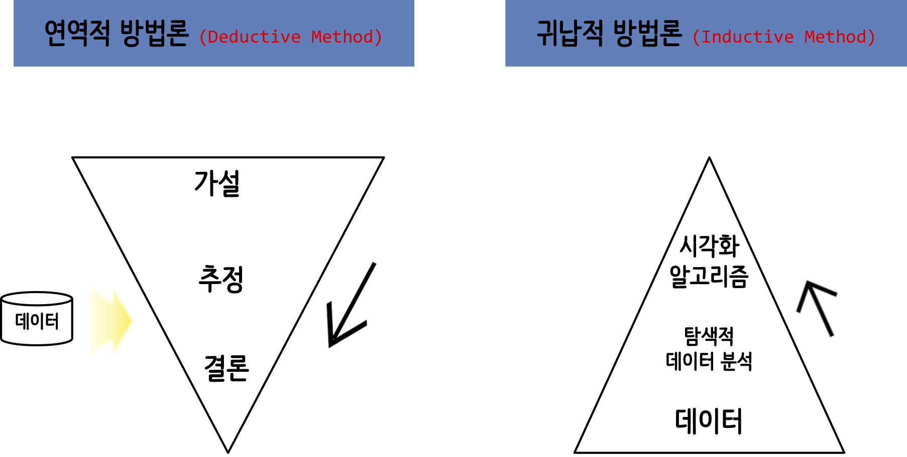
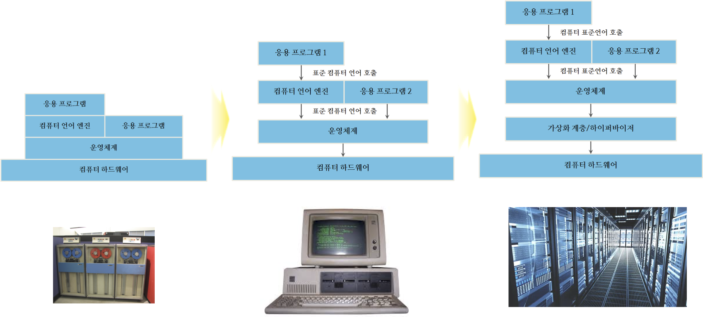
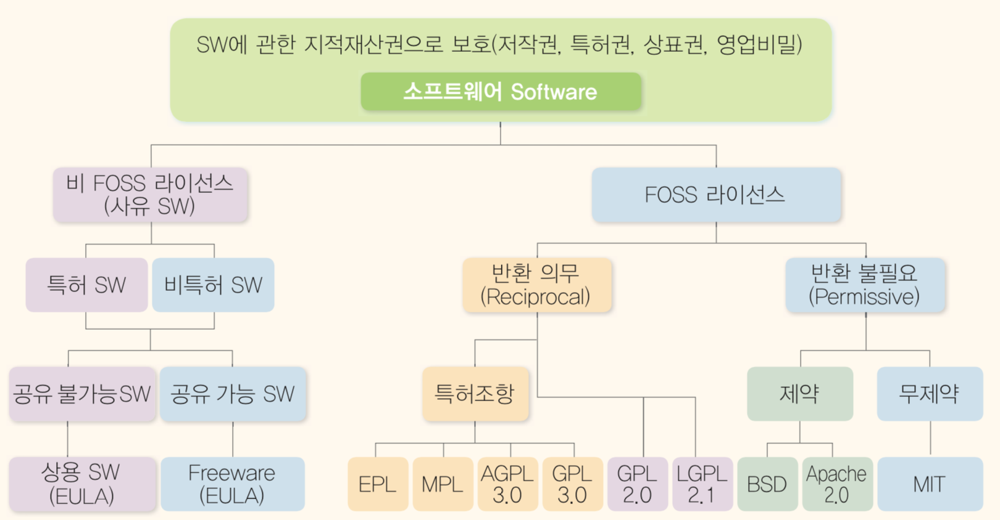
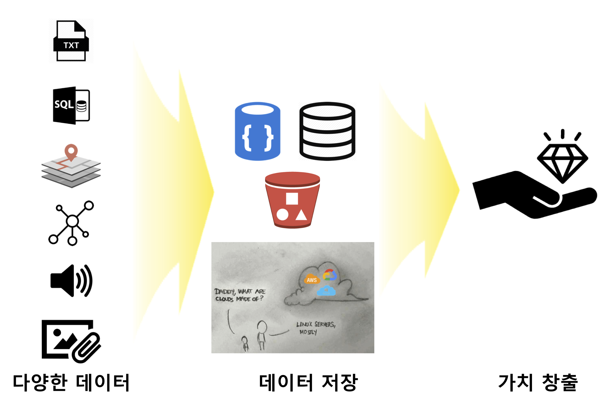

# 국가와 회사의 흥망 {#data-trends}

  

**GDP 상위 15국 (1970-2017) **

<iframe width="300" height="180" src="https://www.youtube.com/embed/jCNSqEwh7GQ" frameborder="0" allow="accelerometer; autoplay; encrypted-media; gyroscope; picture-in-picture" allowfullscreen></iframe>

 

데이터 출처: UNdata - http://data.un.org/
  

  

**글로벌 브랜드 가치 상위 15사 (2000-2018)**

<iframe width="300" height="180" src="https://www.youtube.com/embed/BQovQUga0VE" frameborder="0" allow="accelerometer; autoplay; encrypted-media; gyroscope; picture-in-picture" allowfullscreen></iframe>

 

데이터 출처: https://www.interbrand.com/
  

# 데이터의 가치 {#value-of-data}

- [손씻기 그리고 통계 - 제멜바이스](https://statkclee.github.io/statistics/stat-hand-washing.html)
- [기념비적인 시각화 역작모음](https://statkclee.github.io/viz/viz-history.html)
- [독일 V2로켓 영국 폭격](https://statkclee.github.io/statistics/stat-flying-bomb-poisson.html)
- [러시아 월드컵(2018) - 한국 vs 독일](https://statkclee.github.io/viz/viz-worldcup-germany.html)
- [코에이(Koei) 삼국지 국력비교](https://statkclee.github.io/data-product/dp-koei-three-kingdoms-powers.html)
- [저출산과 소요예산 - 상관관계](https://statkclee.github.io/viz/viz-low-birth-rate.html)
- [지진해일 대피소 - `crosstalk`](https://statkclee.github.io/viz/viz-earthquake-shelter.html)
- [일본 캐릭터와 미디어 프랜차이즈](https://statkclee.github.io/data-product/dp-media-franchise.html)
- [서울대학교 경제학과 - 국내박사배출](https://statkclee.github.io/data-product/data-journalism-snu.html)
- [국세 세금 데이터 분석](https://statkclee.github.io/election/election_tax_EDA.html)

## 데이터 산업 {#data-industry-from-seminar}

세계은행(World Bank)과 한국개발연구원(KDI)은 약 2년여 기간의 공동연구를 통해 1960-2005 년간 한국 경제발전 과정에 관한 보고서를 출간했다. 경제성장이 지속되기 위해서는 생산성 증가가 대단히 중요하고, 1960년 이후 한국경제의 성공은 광의의 지식축적에 기인한 것으로 1960-2005년 사이 한국의 실질 1인당GDP의 75%가 광의의 지식축적에 기인한 것으로 분석했다.

경제발전단계에 따라, 교육 및 인적자원 개발 확대, 과학기술투자, 정보통신 인프라 확충을 통해 지식경제(Knowledge Economy)로의 전환을 이루고 괄목할만한 경제발전을 이룬 것으로 보고서는 적시하고 있다.

{#id .class width=77%}

바다에서 실종되기 전에 짐 그레이 박사는 모든 과학에서 데이터는 기하급수적으로 증가하고 있고, 거의 모든 과학은 데이터 주도(Data-driven) 현상이 나타나고 있는 사실을 알렸다. 물리학과 생명과학이 통계와 컴퓨터 과학의 빅데이터를 통한 수렴현상도 심심치 않게 볼 수 있으며, 이를 4가지 과학의 시대로 정의하였다.

- 실증 과학(Empirical Science): 수천년에 걸쳐 자연현상을 실증 과학의 시대.
- 이론 과학(Theoretical Science): 수백년에 걸쳐 모형과 일반화를 통한 이론 과학의 시대.
- 계산 과학(Computational Science): 수십년에 결쳐 복잡한 현상을 모의실험을 컴퓨터를 사용한 계산 과학 시대.
- 데이터 집약 과학(Data-Intensive Science): 현재는 이론, 실험, 통계를 사용한 계산 결과를 통합하는 데이터 집약 과학 시대.

과학은 가정-주도(Hypothesis-Driven)에서 데이터-주도(Data-Driven) 발견으로 급격히 이동 중에 있으며, 전혀 새로운 도전에 직면하고 있다.

## 원자재 데이터 [^unplugged] {#raw-material-data}

[^unplugged]: ["컴퓨터 과학 언플러그드"](https://statkclee.github.io/unplugged/)

컴퓨터(Computer)라는 말은 라틴어 "computare"에 기원하는데 계산하고 더한다는 의미를 지니지만, 오늘날 컴퓨터는 거대한 계산기 이상이다. 컴퓨터는 도서관도 될 수 있으며, 컴퓨터로 글을 작성할 수 있으며, 정보를 찾고, 음악을 연주하고, 영화를 보기도 한다. 그런데 컴퓨터는 이렇게 많은 모든 정보를 어떻게 저장할까? 믿든 믿지 않든, 컴퓨터는 단지 두 가지만을 사용한다. 영('0')과 일('1')이다.

빅데이터 시대를 맞이하여 데이터는 도처에 널려있지만, 오랜 세월을 거치면서 데이터는 나름대로 각자의 서식지를 가지게 되었다. 과거 중요한 정보를 관계형 데이터베이스에서 체계적으로 관리를 했다면 빅데이터를 저장하고, 처리하고, 활용할 수 있는 기술은 비약적으로 발전하여 최근에는 이를 기계학습과 딥러닝 기법을 적용하여 혁신을 통해 가치를 창출하는 단계로 넘어가고 있다.

{#id .class width="100%"}

## 데이터 공학과 사업화 {#data-engineering}

다양한 데이터 원자재를 산업화하는 과정은 다양한 실험을 통해서 성공했던 과학기술이 비로소 사업화와 접목되어야만 가능하다. 데이터 원자재를 엑셀과 같은 형태의 직사각형 정형데이터로 가정한다면 이를 사업화하여 얻을 수 있는 실익은 크지 않다. 하지만, 데이터 원자재를 정형 데이터 뿐만 아니라, 이미지, 텍스트, 소리, 로드 등 비정형 데이터를 아우르게 되면 데이터의 양과 질, 그리고 속도에서 비교가 되지 않는 고도의 기술을 필요로 한다.

빅데이터를 저장하게 된다는 것의 의미는 이제 데이터 산업을 꽃피울 수 있는 원자재를 수급할 수 있는 토대를 만든 것에 불과하다. 데이터 사이언스를 통해 유의미한 무언가를 찾아내는 무수한 실험을 반복해야 하고, 이를 통해 나온 극히 일부만이 사업적인 의미를 갖는다고 할 수 있다. 이러한 데이터 사이언스 발견을 토대로 데이터 공학을 적용시켜 실제 데이터 제품을 양산함으로써 비로소 시장에 출시하게 된다. 모든 제품과 서비스가 시장에서 성공하지 못하듯이 데이터 공학을 통해 살아남은 데이터 제품도 혹독한 시장 검증을 거치게 되고 그 일부가 사업화에 성공하여 빛을 발하게 된다.

{#id .class width=77%}

## Industry Vertical &rarr; 플랫폼 {#towards-platform}

{#id .class width="100%"}

# 기본지식 {#basic-concept}

논리적 사고의 근간을 이루는 가장 중요한 밥법론이 귀납법과 연역법이다. 개별적인 특수한 사실이나 원리를 전제로 하여, 즉 데이터를 바탕으로 하여 일반적인 사실이나 원리로서의 결론을 이끌어 내는 연구 방법으로 인과 관계를 확정하는 데에 주로 사용된다. 반면 연역에 따른 추리의 방법은 일반적 사실이나 원리를 전제로 하여 개별적인 특수한 사실이나 원리를 결론으로 이끌어 내는 추리 방법으로 경험에 의하지 않고 논리상 필연적인 결론을 도출하는 것이 가능하고, 흔히 삼단 논법이 그 대표적인 형식으로 자리 잡고 있다. 하지만, 최근에 통계검증과 결합하여 논리적 사고에 따른 오류를 바로잡고 새로운 인사이트를 찾고자 하는 시도가 일반적이다.

{#id .class width="100%"}

## 통계학 {#basic-concept-statistics}

통계학은 영어로 ‘Statistics’인데 이는 국가(State)를 통치하는 데 필요한 학문이라는 어원을 갖고 있고, 통계학은 크게 세 단계로 정의된다.

- 자료를 수집 (sampling),
- 자료를 분석 (analysis),
- 이를 바탕으로 일반화된 결론을 끌어냄(generalization)

“자료 그 자체에 충실하라(Let the data speak for themselves)”는 말이 있다. 과학적 성과의 입증이나 정부의 정책을 뒷받침하는 과정에서 자료나 통계가 조금이라도 왜곡되거나 조작되면 안 된다. 이를 흔히 우리는 통계의 중립성과 독립성이라 부른다.

자료 그 자체에 충실하기 위해서는 데이터가 만들어지는 과정에 대한 이해가 반듯이 필요하다. 데이터는 **관측 데이터(Observational data)**와 **실험 데이터(Experimental Data)**로 나뉜다. 데이터 자체가 두집단을 표현하더라도 생성과정이 달라 이를 통해서 얻을 수 있는 추론 결과도 다르게 된다.

{#id .class width="100%"}

- **무작위 추출(random sampling)**은 모집단에서 표본을 추출할 때 아무나 골라서 무작위로 뽑는 것을 의미한다.
- **무작위 할당(random assignment)**은 표본을 집단에 집어넣을 때 무작위로 각 집단에 할당하는 것을 뜻한다.

무작위 추출을 하게 되면 일반화(Generalization)가 가능하지만, 무작위 표본 추출이 아닌 데이터에서 얻은 정보는 일반화를 하면 안된다.
유사하게 무작위 할당을 해서 얻게 된 정보를 바탕으로 인과관계를 도출할 수 있지만, 무작위 할당을 하지 않은 경우는 인과관계를 예단할 수는 없다.

{#id .class width="77%"}

## 심슨의 역설 {#simpson-paradox}

- [데이터 과학 – 기초 통계 :" 심슨의 역설(Simpson Paradox)"](https://statkclee.github.io/statistics/stat-simpson.html)

## 컴퓨터와 소프트웨어 {#basic-concept-software}

### 컴퓨터의 진화 [^business-for-software] {#basic-concept-software-evolution}

[^business-for-software]: ["비즈니스를 위한 오픈 소스 소프트웨어 한국어 번역 - 2장 컴퓨터 소프트웨어 과외"](http://statkclee.github.io/open-source-for-business/ch02-tutorial-on-computer-software.html)

동시대 컴퓨터 처리가 많은 계층에서 일어난다. 이 점에 있어서, 지난 20~30년에 걸쳐 컴퓨팅은 엄청나게 변했다. 옛날에는 프로그래머 한명이 단일 프로세서에서 돌아가는 프로그램을 하나 작성했다. 그 시절에, 모든 비트의 기능이 컴퓨터 프로세서의 희귀 시간과 공간 자원을 차지해서 구현되었다. 오늘날, 프로세서는 더 커지고 더 빨라졌고, 많은 프로그램을 한번에 처리할 수 있다. 그래서 컴퓨팅이 더 모듈화 되었다.

{#computer-industry-evolution}

### 소프트웨어 {#basic-concept-software-license}

근래에 들어서, 오픈소스 소프트웨어가 무엇인지 설명할 필요는 없다. 한때 이상하게 꼬인 소프트웨어 라이선스로 간주되던 것이 이제는 전체 소프트웨어에 대한 튼튼한 기반이 되었다. 대부분 사람들이 “오픈소스”를 언급할 때, 소프트웨어 라이선스 집합을 지칭한다. 이런 라이선스는 사용권을 주는 누군가가 소프트웨어 사용에 대한 이용약관을 정했다. 이런 의미에서, 오픈소스는 라이선싱 모형(Licensing Model)이다. 하지만 또한, 아마도 좀더 중요하게 오픈소스는 소프트웨어 개발에 대한 모형이기도 하다.

지적재산권의 보호범위와 소프트웨어 라이선스 구분은 NIPA에서 발간한 "공개 SW 라이선스 가이드"를 참조한다.

{#id .class width="100%"}

## 데이터 과학 [^data-science] [^tidyverse-stat] {#basic-concept-data-science}

[^tidyverse-stat]: ["데이터 사이언스 운영체제 - tidyverse", 한국통계학회 소식지 2019년 10월호](https://statkclee.github.io/ds-authoring/ds-stat-tidyverse.html)

[^data-science]: [Tidyverse Korea, "데이터 과학 (Data Science) - 데이터 과학 교육"](https://statkclee.github.io/data-science/ds-education.html)

다양한 데이터 예를 들면, [텍스트 데이터](https://statkclee.github.io/text/), [직사각형 데이터](https://statkclee.github.io/data-science/), [시각 데이터](https://statkclee.github.io/trilobite/), [네트워크 데이터](https://statkclee.github.io/network/), [공간정보 지도데이터](https://statkclee.github.io/spatial/), [문서 데이터](https://statkclee.github.io/comp_document/) 등 다양한 형태의 데이터를 취합할 수 있고 이용할 수 있는 세상이 되었다.

이와 더불어 [빅데이터 - 스파크](https://statkclee.github.io/bigdata/),
[고성능 컴퓨팅(HPC)](https://statkclee.github.io/hpc/), [클라우드 컴퓨팅 소개](https://statkclee.github.io/cloud-genomics-kr/), [R 병렬 프로그래밍](https://statkclee.github.io/parallel-r/) 등을 활용하여 정형, 비정형 데이터를 저장하고 쉽게 접근하여 가치를 창출할 수 있는 시대가 열렸다.

다양한 데이터를 발굴하고 이를 축적하게 되면 이를 이해할 수 있는 과정이 필요하다. 이를 위해서 반듯이 필요한 것이 시각화다. 이유는 복잡한 것을 단순화하고 빠른 시간내에 의사결정을 내릴 수 있는 최대한 많은 정보를 제공하는 것이 시각화외에는 다른 대안이 없다. 이를 위해 필요한 것이 대쉬보드다. [시각화](https://statkclee.github.io/viz/)에 대한 다양한 구성요소가 준비되어 있다.

마지막으로 가치를 창출하는 부분이 필요한데 이를 위해서 다양한 비즈니스 사례를 발굴하고 적합한 통계모형/기계학습(machine learning) 알고리즘 적용과 다양한 통계 이론과 기법을 적용하는 것이 필수적이다. 이를 위해서 [xwMOOC 기계학습](https://statkclee.github.io/ml/), [데이터 과학 - 모형](https://statkclee.github.io/model/)에 대한 내용을 참고한다. 그외 빠질 수 없는 내용이 [Deep Learning](https://statkclee.github.io/deep-learning/), [자연어 처리(NLP)](https://statkclee.github.io/nlp2/)를 들 수 있다.

{#id .class width="100%"}

# 자동화 {#automation}

- [자동화(Automation): ~~로봇~~ 자동화가 빼앗는 일자리 그리고 나](https://statkclee.github.io/ds-authoring/ds-bundang-2019.html)

# 교육 {#education}

- 한국통계진흥원, ["통계의 창 2015년 15호"](http://www.stat.or.kr/down/201506.pdf)
- [데이터 산업 인력](https://statkclee.github.io/ds-authoring/ds-4th-ir.html#2_%EB%8D%B0%EC%9D%B4%ED%84%B0_%EC%82%B0%EC%97%85_%EC%9D%B8%EB%A0%A5)

